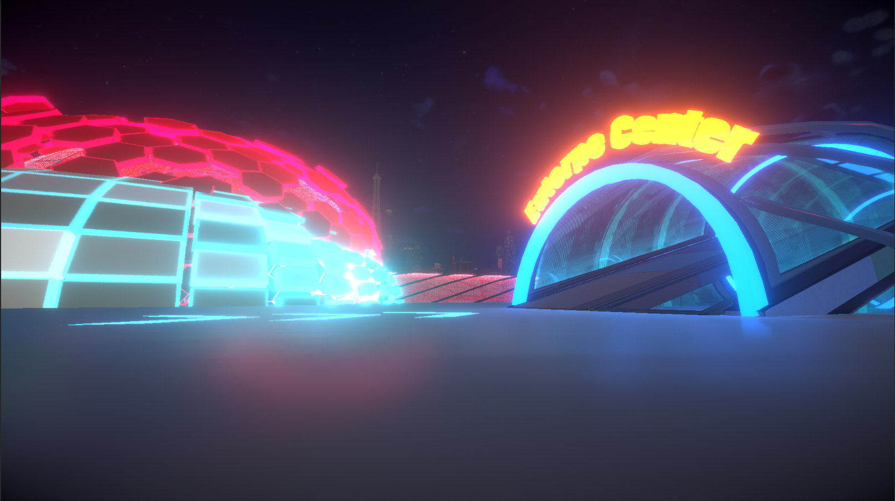
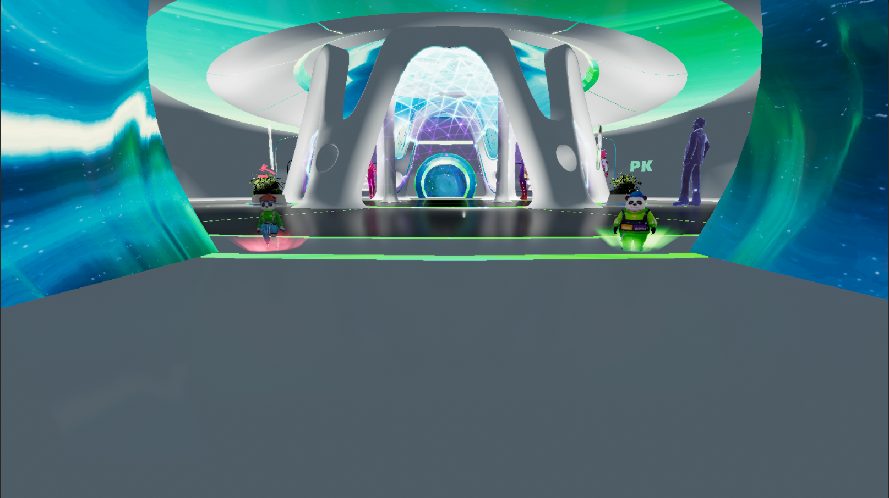

# PK Concerts

<figure><figcaption>
Gateway Entrance
</figcaption></figure>

## Concert Prize Pool

* Gifts received during the performance of each song at the concert will be added to the total prize pool.
* At the end of the performance, the song with the most received gifts will win.
* All participating players who receive rewards for winning songs will distribute the reward amount of other songs according to the reward ratio.

## Reward Distribution Model

* Full Proportionate Share Mode: All participating reward givers on the winning side participate in the share.
* Top Split Mode: Among the reward givers on the winning side, the top 30% by total amount participate in the share.
* PK concerts default to Full Proportionate Share Mode, but the organizer can modify the distribution model before the PK concert starts.
* 80% of the VST in the prize pool of the losing side is used for distribution among the participants on the winning side.
* The game operator will charge 10% of the total VST spent by the losing side as a fee, some of which will go to the song copyright holder.

## **Hosting Rights & Hosts:**

<figure><figcaption></figcaption></figure>

* Each PK concert has hosting rights, which can be obtained through PT auctions at the auction NPC. The auction starts at 2:00 (UTC+0) and 9:00 (UTC+0).
* The player who owns the hosting rights will become the organizer of the PK concert and will receive 10% of the VST prize pool amount from the losing side at the end of the concert. If they are not satisfied with the VST reward amount, they can choose to refund 90% of the PT spent on hosting the concert.
* PK concerts will start at 5:00 (UTC+0) and 14:00 (UTC+0) every day.
* The organizer can set the songs for the PK concert and the distribution model of the concert within two hours before the start of the PK concert. Once confirmed, it cannot be changed again.

