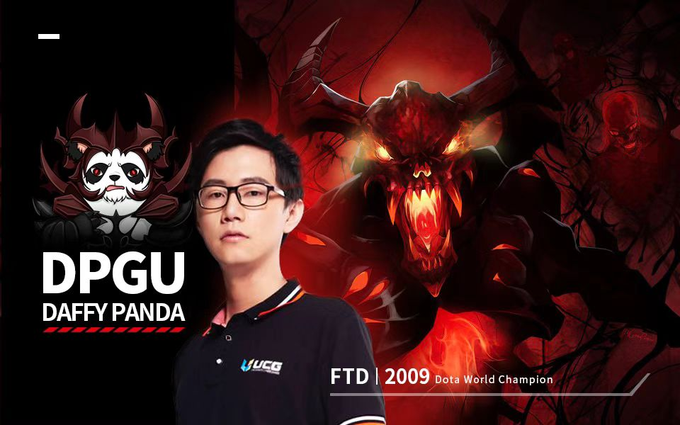
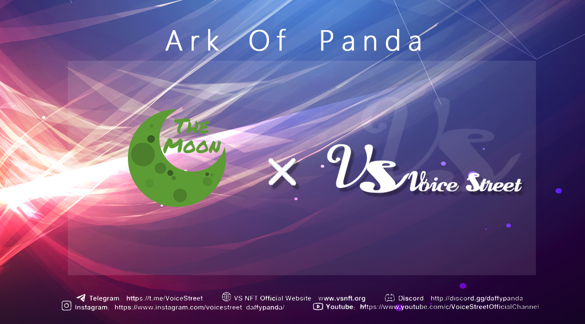
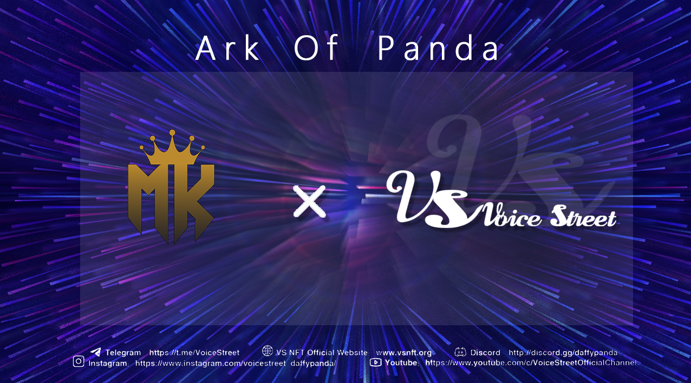
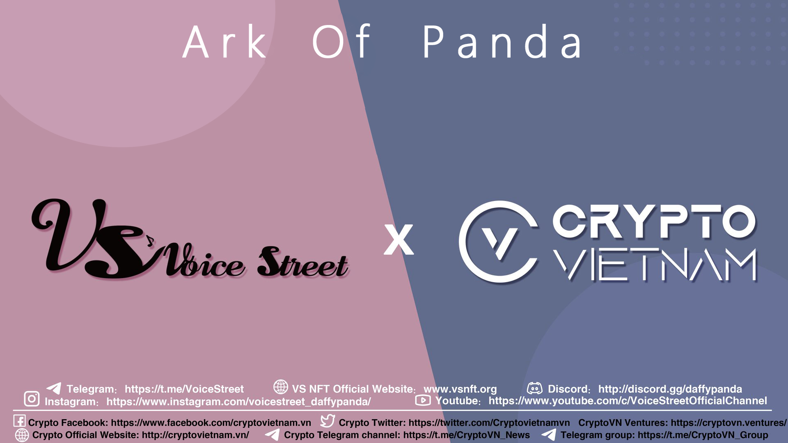
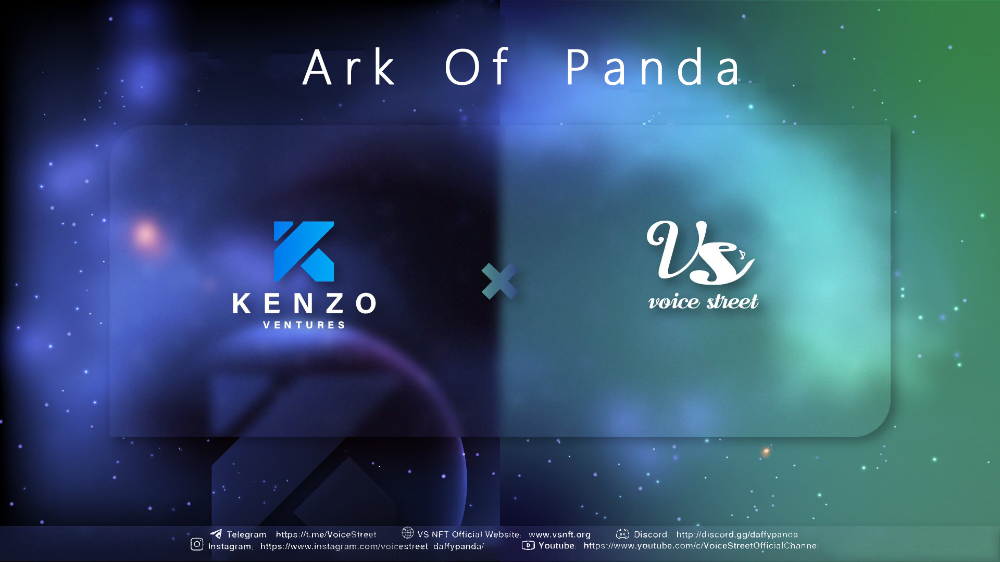
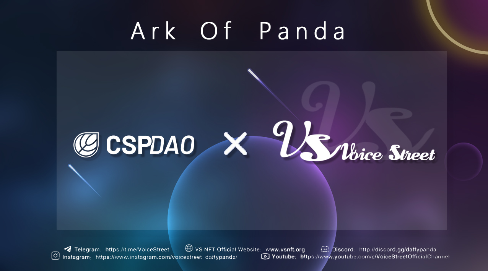
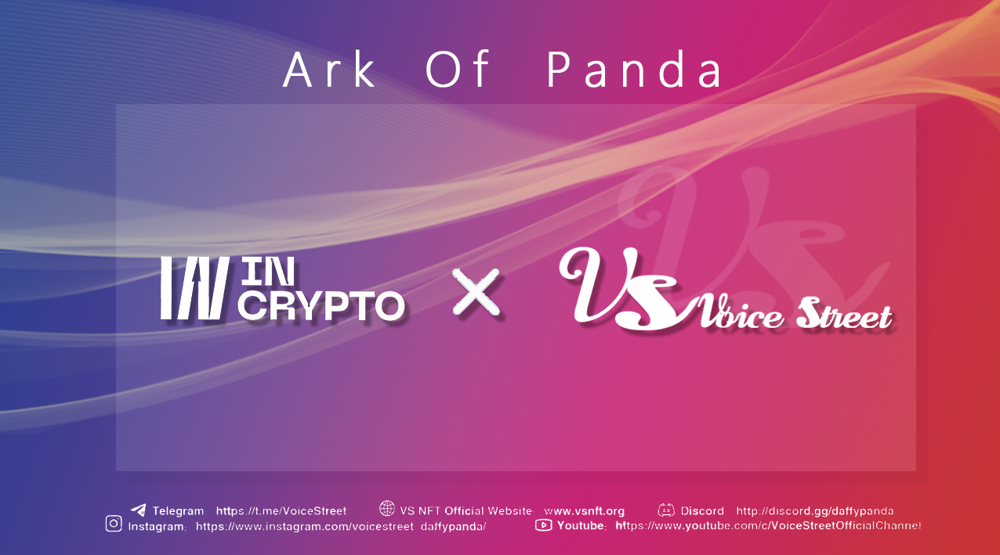
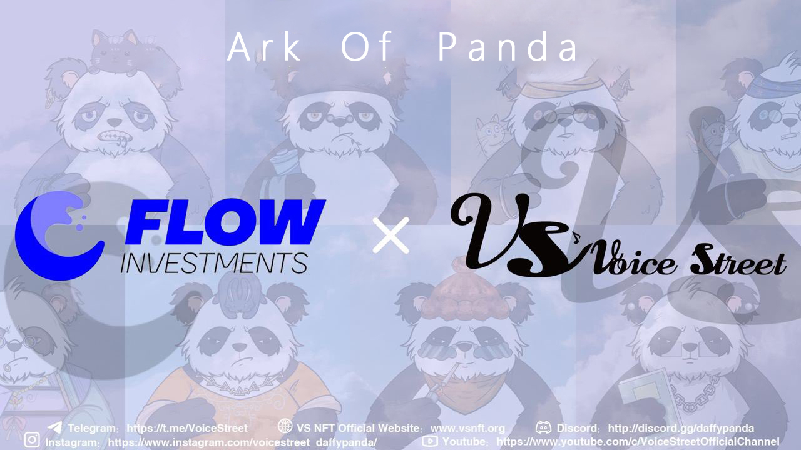
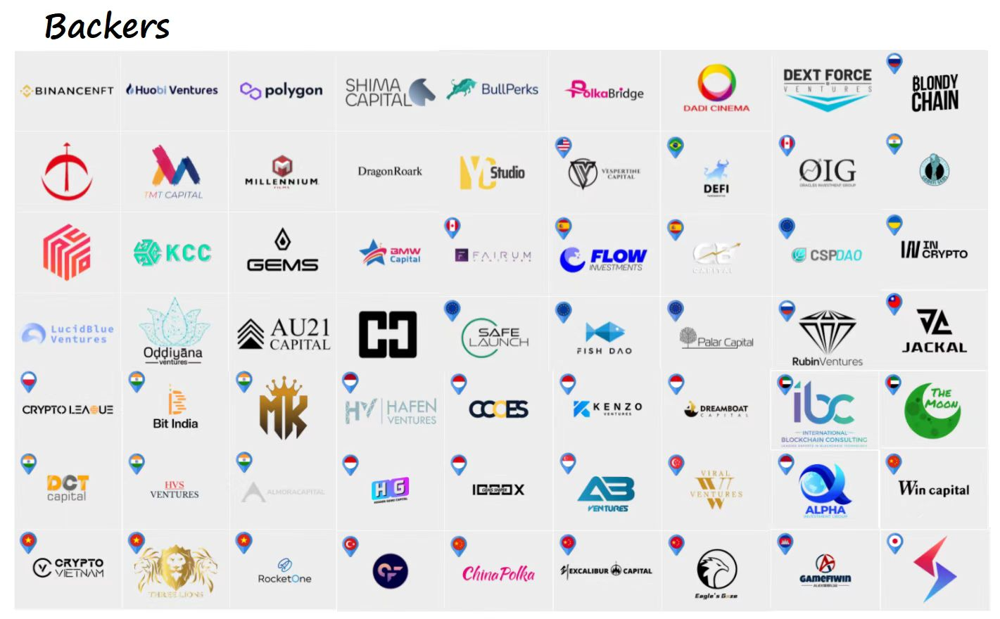

# Community and Partners

## Partners

### FTD|2009

Dota World Champion team FTD，ID：2009 In 2006, Wu Sheng began to contact Dota, in WCG2007, led the AVNC team to eliminate Html a battle of fame; May 2008, joined the Ehome; June, in the SOLO tournament won the first individual tournament championship in life; August 2009, led SGTY team won the SMM09 world championship; June 2010, graduated from college, continue DotA career, transformed into a team manager; August, after participating in the National e-Sports Open held in Shenzhen, announced his retirement; October 2015, returned to the professional circle to re-establish the DOTA2 team FTD team.

### Moon car

[Related Links](https://t.me/TheMoonGroup)

### Money king

[Related Links](https://twitter.com/Mysteryofcrypt)

### CryptoVN Group

[Related Links](https://twitter.com/Cryptovietnamvn)

### KenzoVentures

[Related Links](https://twitter.com/kenzo\_ventures)

### Vespertine

[Related Links](https://twitter.com/vespertinecap)

.jpg>)

### CSP DAO

[Related Links](https://cspdao.network/)

### CIS community

[Related Links](https://t.me/incrypt0)

### Flowinvestments

[Related Links](https://youtube.com/c/InversionesencriptomonedasSantiL%C3%B3pez)

## Backers

