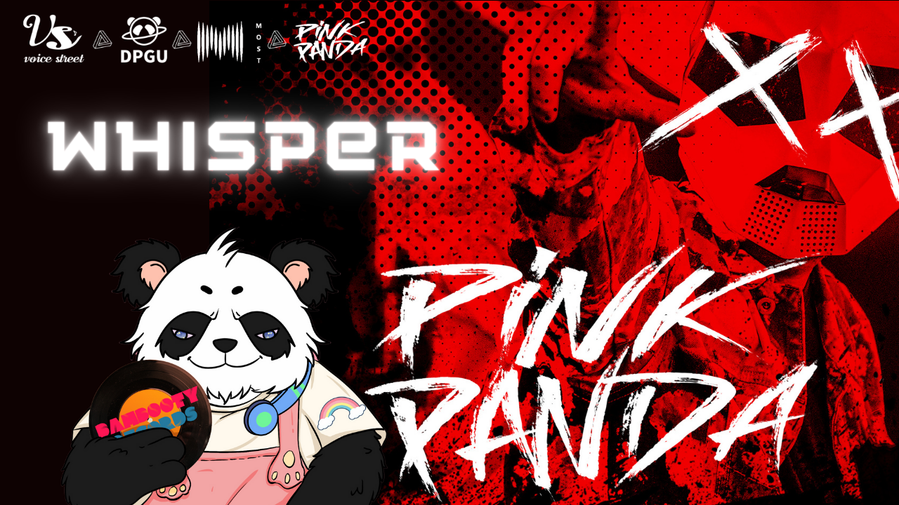
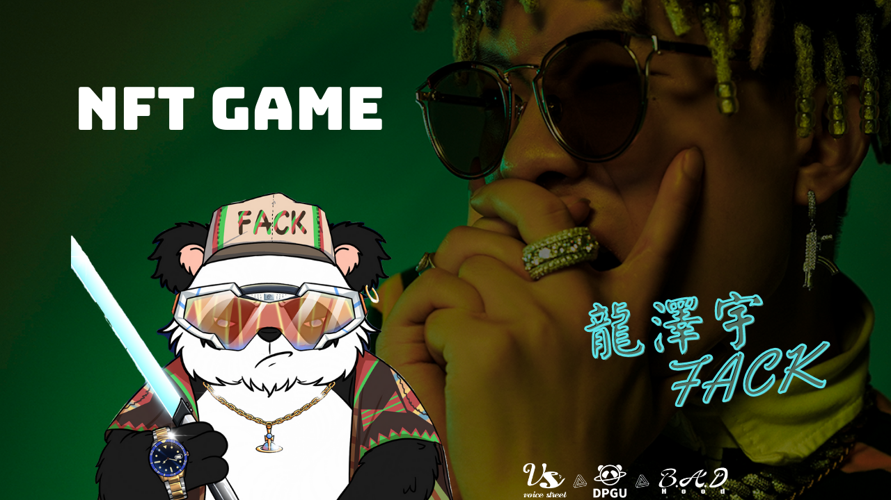
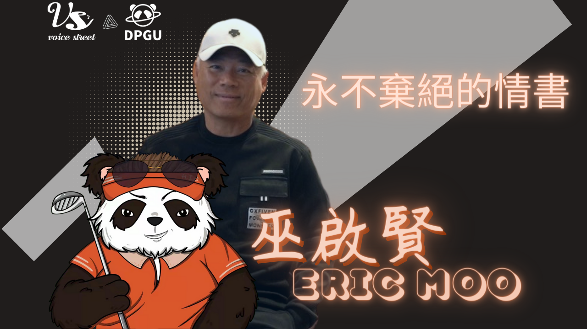

# Musicians

### PinkPanda

Ranked 65 in the Top 100 DJs The DJ collective originating from the U.K. (est. 2012) have marked themselves as the major labels’ go to remixer production outfit over the past years; Stupid Love Remix - broadcasted on BBC Radio1 in the UK; Love It Like That feat Nyanda - over 13 million Spotify plays and played on radio stations worldwide; Tomcraft - Loneliness (Pink Panda Remix) - ranked 2 on Armada Spotify; Finesse Remix - ranked 1 on Beatport Dance for 5 weeks long; Scream Out Loud - once issued, straight to #11 on Apple Music China； Catalog of official remixes for the likes of Ava Max, Bruno Mars, David Guetta, Dua Lipa, Meduza, P!nk & Sia.

### Kvin Shin

Kevin Shin has a very high reputation in South Korea. He won the best newcomer award, best rap song nomination, best rap album award, best jazz/soul song nomination and many other big awards in South Korea. Internationally, he cooperated with superstars such as Chris Brown and Ty. Dolla Sign. He was also invited by the BURBERRY brand to participate in the production of endorsement theme songs. He has been highly recognized all over the world.

### 22Bullets

22Bullets is a Thai DJ and producer. He won the Pioneer Battle Scratching DJ championship in 2009.He is ranked 92nd on the Top 100 DJs of 2021. He has cooperated with many top DJs such as Dimitry Vegas & Like Mike and Deorro, and was listed on SPOTIFY as "The first producer in Southeast Asia to reach over 1 million listeners per month". Now signed to Warner Music's pan-Asian dance label Whet Records.

### KAKA

Top Chinese female DJ DJ, music producer and singer Representative works: "Beijing" "Lit" "Rainbow" "Dynasty" "Needs" "Actin Out" "Someday" Won the champion of the PIONEER DJ competition(China); She has been a judge in China for the PIONEER DJ Pioneer Cup Competition for three consecutive years; Starred in popular Chinese TV shows "GAI SHI YING XIONG", "ZHONG GUO YOU XI HA", "RE XUE JIE WU TUAN", "BEN PAO BA","ZHONG GUO XIN SHUO CHANG"; First Chinese female DJ to enter Ibiza Island, Spain; Represented Chinese female DJs in the DJ MAG Top 100 DJs.

### FACK

Hip Hop MV Director, Rapper, Songwriter, Visual Designer and Producer; Former member and visual designer of Sup Music's rap duo Southside Boyz Killa (SBK);

Not limited to Trap music, but also independently produced a large number of melody rap and R\&B;

The first Mixtape from Long's label, 7K was released on December 7, 2015. Once released, the album was highly rated by many rap groups including Honghuahui, ShuoChnagHuiGuan and many others;

From 2012 to 2019, he has filmed and produced hundreds of MVs for most of the well-known rappers in China, such as C-block, Gai, Vava, Mc Hot Dog, Gem, etc;

Since 2019, he has taught himself mixing and music production and released several high-quality singles, including "City Light" and "Magic Flower" with Modongshanba, "Berry remix" with Li Jialong, a single "All 4 U", the collaborative album "Guang Sheng Qi" with newcomer rapper Yugo, and a new solo album "Liu Fang", etc.

### ERIC MOO

Recipient of several Singapore New Music Awards for Best Honors, Best Composer, Best Male Singer, etc.(Singapore); Won consecutive awards in the Malaysian Entertainment Association Awards, the only one in the Chinese music industry musician to receive the honor of "Malaysian God of Song" by the Malaysian government.(Malaysia）; Won the Golden Melody Award for many years(HK); The first person to receive the "Asian Outstanding Artist Award" from Billboard (USA); Release in many movies ,1996 won the Best New Artist Award at the HK Film Awards ; Participated in many recordings as quality music critic and host、Held hundreds of solo concerts around the world; As a Christian, he has spent many years preaching and teaching around the world, participating in charity activities and leading thousands of people to faith in Christ.

