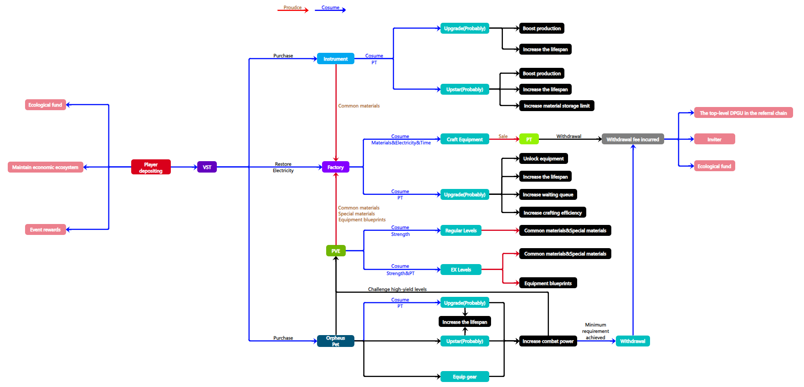

# Tokens Relations

Ark of Panda is a blockchain game based on the Binance Smart Chain (BSC). The in-game tokens VST and PT are both issued on the BSC, enabling players to participate more conveniently in in-game transactions and economic activities.

<figure><figcaption></figcaption></figure>

## VST (Voice Street Token)

1. VST can only be purchased on Token Exchange. The Voice Street platform will utilize VST for transactions related to music NFT products, celebrity IP NFT transactions, IMO publishing, Live House online concerts, and more.
   * Users can invest in musician-related NFTs, such as album covers, concert posters, and other unique digital artworks, by purchasing IMO tokens, thereby building their digital collections.
2. VST is also the sole currency used within the game for purchasing instruments and pets.
3. Players need to spend VST to participate in PVP battles, hoodle game, and to send gifts during PK concerts.
4. VST will also be used for expenditures related to fan-related products or services (such as helping performers on specific rankings develop derivative products), and IMO products on the Voice Street platform will also be crowdfunded through VST.

#### How to acquire VST

* Acquire through Token Exchange;
* Winning in PVP battles and PK concerts;
* DPGU holders can claim VST daily at Daffy Citadel;
* Ranking rewards;
* Superband rewards;

## PT（Panda Token）

1. PT is the only token produced within the Ark of Panda world.
2. The utility of the PT is as follows:
   * Upgrading instruments and factories;
   * Upgrading Orpheus pets;
   * Game challenges: The four mini-games in the Music Carnival and EX levels in PVE require PT to participate;

#### How to acquire PT

* Crafting and selling equipment at factories;
* Winning in mini-game leaderboards;
