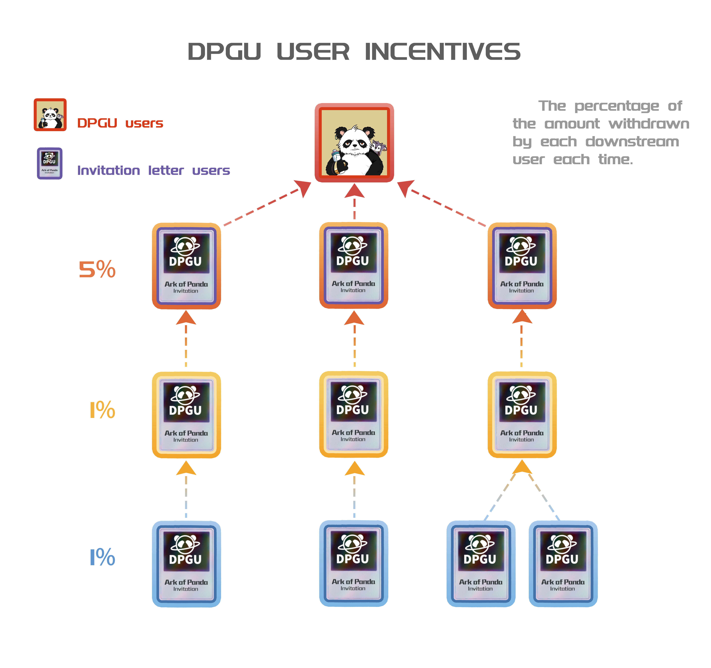
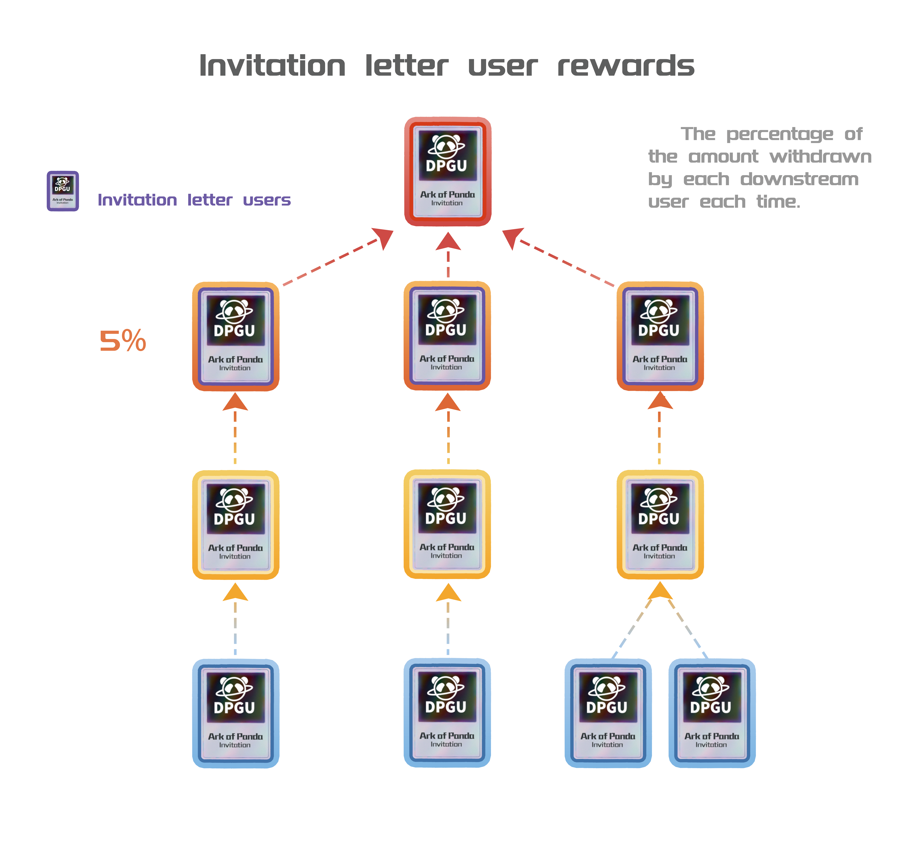

# Benefits of DPGU holders

## Exclusive Club - Daffy Citadel

<figure><figcaption></figcaption></figure>

A club exclusively for DPGU holders that only DPGU holders can access and receive exclusive benefits;

## Daily VST benefits

<figure><figcaption></figcaption></figure>

1. DPGU holders can claim VST rewards daily at Daffy Citadel.
2. The daily VST rewards pool comes from a portion of the fees collected from in-game player participation in PVP battles, PK concerts, and pinball games.
3. The weight of DPGU holders' share in the VST rewards pool is determined by the level of their DPGU. The higher the DPGU level, the greater the weight, and the more rewards received.
4. The VST rewards pool refreshes daily at 8:00 (UTC+8). Any unclaimed VST will be sent to a black hole.

## Invitation Rewards

1. DPGU holders can invite regular players to play Ark of Panda and receive 5% of the withdrawal amount from the directly invited players as a reward.
2. For indirectly invited players, meaning new players invited by directly invited players, and even players invited by users who received invitation letters, DPGU holders will receive 1% of their withdrawal amount as a reward.
3. Note: Invitation letter users can only receive 5% of the withdrawal amount from their directly invited players as a reward.

<figure><figcaption>
DPGU Rewards
</figcaption></figure>

<figure><figcaption>
Invitation users Rewards
</figcaption></figure>

## Airdrop Rewards

We will distribute exclusive airdrop rewards to DPGU holders, which can be claimed at Daffy Citadel. These rewards include rare and valuable items such as the Orpheus companion pet Twinkle, exclusive limited edition instrument DPGU-INFINITE, cool vehicles, avatar costumes, tickets to the First Concert, private properties, and mysterious furniture. The higher the DPGU level, the rarer the airdrop rewards.

## Personalized Privileges

DPGU holders also enjoy exclusive venue access, character customization options, Priority Land Mint Rights, and a series of unique privileges such as commercial license NFTs.

## Level-up DPGU

In the world of Ark of Panda, opportunities don't just come out of nowhere; they gradually blossom as DPGUs are Level-up, and each Level-up to a DPGU opens up brand new entitlements and opportunities for DPGU holders, making the metaverse journey of DPGU holders all the more exciting to look forward to.

Imagine that every Level-up means DPGU holders will get more advanced and precious rights and benefits. DPGU holders will no longer be just a string of numbers but a key with unlimited possibilities to open the exciting world of the metaverse.

Not only that, the wisdom of DPGU holders will empower DPGU holders even more. DPGU holders will be able to collect and Level-up the NFT entitlements of the DPGU accounts used for upgrading that have been consumed to the chain beforehand, thus acquiring an extra copy of a lower-level NFT item while acquiring a higher-level entitlement. Upgrading DPGUs is not only a rebate for upgrading but also an extension of the wisdom and creativity of DPGU holders.

Upgrading is not just about getting more; it's a way to explore greater possibilities. Under the starry sky of the metaverse, every Level-up will be an opportunity for DPGU holders to master their rights and interests, making the journey of DPGU holders in the metaverse even more exciting and colorful. Don't miss out and enter a brighter world.

