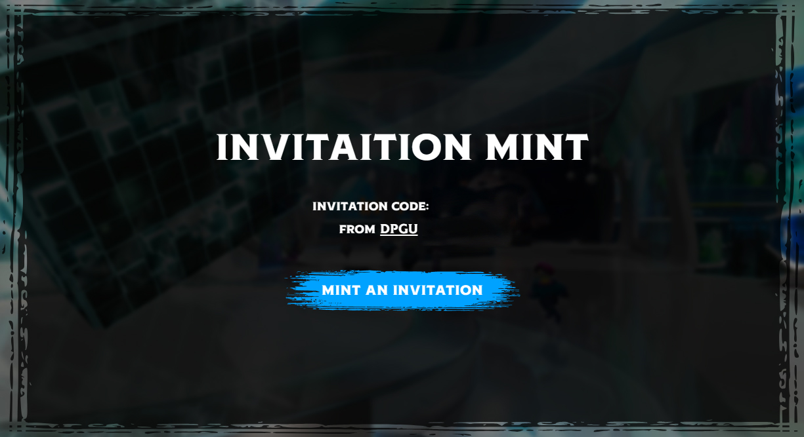
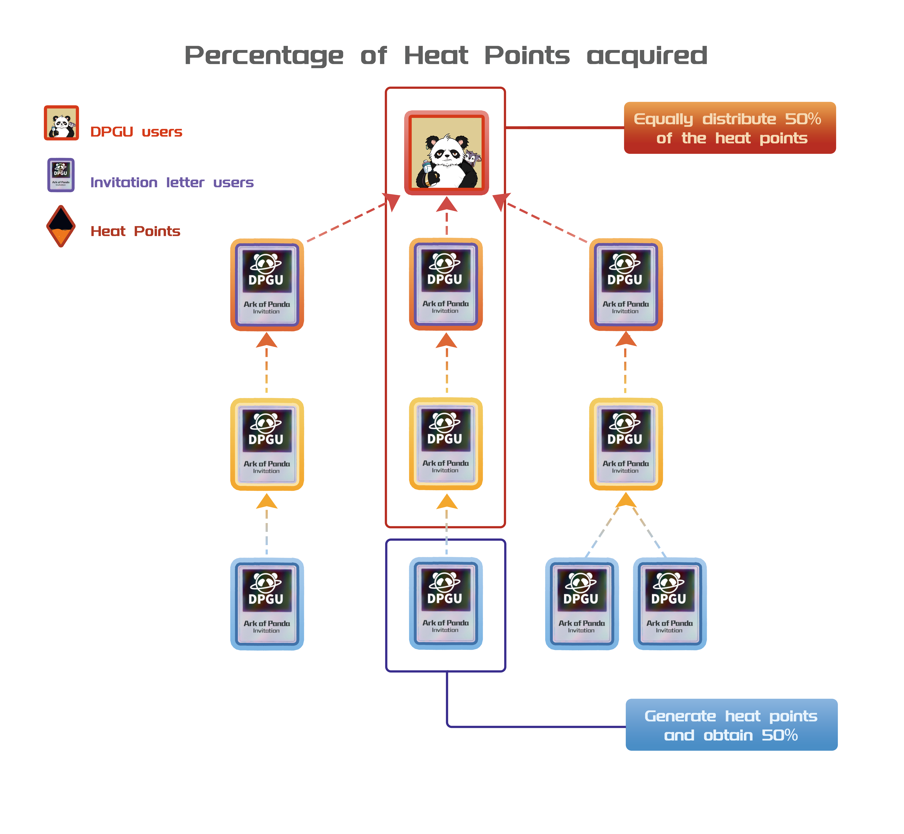

# DPGU Invitation

Ark of Panda is an invitation-only game, where esteemed DPGU holders can directly enter the Ark of Panda world and send out invitation letters to invite others to join.

DPGU holders can freely distribute invitation links. Non-DPGU users who receive the invitation can click the link to enter the corresponding website and mint an invitation letter. Upon successful minting, non-DPGU users can also explore the Ark of Panda world through the invitation letter.

<figure><figcaption>
Invitation Letter
</figcaption></figure>

Note: Users with invitation letters can also send invitation links to invite others to join.

## Super Band Leaderboard

DPGU holders who successfully invite players to join Ark of Panda will form a Super Band, with the DPGU user as the team leader. All players successfully invited thereafter by the Super Band members will belong to that DPGU user's Super Band.

<figure><figcaption>
Heat Points Allocation
</figcaption></figure>

Super Band members can earn Heat Points, starting at 0% and reaching a maximum of 1000%. Regular members of the Super Band can receive 50% of the generated Heat Points, while the remaining 50% will be evenly distributed among users in their invitation chain.

The method of obtaining Heat Points:

* Obtained by consuming PT;
* Obtained by consuming VST;

Super band members share a prize pool, where the VST in the pool comes from 1% of the consumption made by super band members. Members can draw VST from the pool using a roulette wheel. Initially, each member has 0 draw attempts. When their heat index reaches 100%, they can draw from the pool. Drawing consumes all current Heat Points.

The values on the roulette wheel represent the amount of VST to be drawn, which is influenced by the player's current Heat Points. The final displayed value is calculated as the base value multiplied by the Heat Points. For example, 50 \* 200% = 100. DPGU users also enjoy additional multiplier bonuses.

The top ten Super Bands with the highest total Heat Points can share the leaderboard prize pool, with the VST in the pool coming from 1% of the in-game player consumption. The higher the ranking, the greater the weight, and the more VST they receive.
