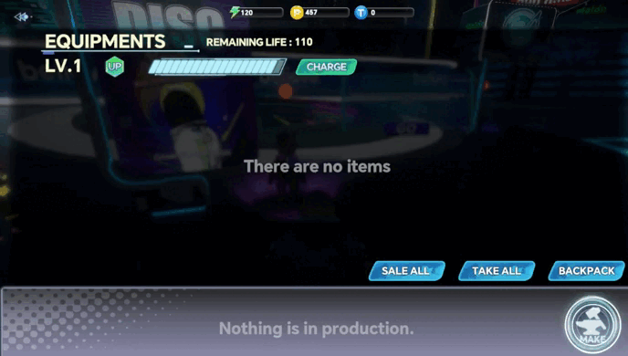

# Factory\&Equipment

## Factory: economic hub

The factory is an important economic facility in the world of Ark of Panda, serving as the sole source of PT production by Daffy Panda.

<figure><figcaption></figcaption></figure>

The factory is the sole means in the game to convert materials into equipment. Players must spend a certain amount of time and electricity in the factory to craft various equipment using the materials they possess.

## The production mode of the factory:

1. The production of equipment in the factory requires the consumption of regular materials, special materials, electricity, and time. Electricity cannot be automatically restored and requires spending VST to recharge.The amount of electricity consumed in equipment production is only related to the equipment.
2. Higher-level equipment production requires the consumption of equipment blueprints to unlock. These blueprints are obtained from PVE EX Levels.
3. The factory can be upgraded to a maximum of level 20, with each upgrade requiring the consumption of PT. However, there is a chance of failure during the upgrade process, with the likelihood of failure increasing as the factory level rises.The higher the level of the factory, the more equipment it can produce, and the higher the efficiency of equipment production.

|     Level     | Probability |     Level     | Probability |
| :-----------: | :---------: | :-----------: | :---------: |
|  Lv.1 → Lv.2  |     100%    | Lv.11 → Lv.12 |     80%     |
|  Lv.2 → Lv.3  |     100%    | Lv.12 → Lv.13 |     75%     |
|  Lv.3 → Lv.4  |     95%     | Lv.13 → Lv.14 |     75%     |
|  Lv.4 → Lv.5  |     95%     | Lv.14 → Lv.15 |     70%     |
|  Lv.5 → Lv.6  |     90%     | Lv.15 → Lv.16 |     70%     |
|  Lv.6 → Lv.7  |     90%     | Lv.16 → Lv.17 |     65%     |
|  Lv.7 → Lv.8  |     85%     | Lv.17 → Lv.18 |     65%     |
|  Lv.8 → Lv.9  |     85%     | Lv.18 → Lv.19 |     60%     |
|  Lv.9 → Lv.10 |     80%     | Lv.19 → Lv.20 |     60%     |
| Lv.10 → Lv.11 |     80%     |               |             |

1. The factory has a lifespan that decreases every day. The reduction in points is related to the factory's level. After the factory reaches a certain level, the daily reduction in lifespan points increases. Upgrading the factory level can increase its lifespan. With each upgrade to a certain level, the additional lifespan points also increase.
2. The factory can simultaneously produce 3 pieces of equipment, with the remaining items in the production queue. The capacity of the production queue increases as the factory level rises, ranging from 1 to 20 items. The completed equipment remains in the completion area, and upgrading the level can increase the capacity of the completion queue, ranging from 20 to 115 items.

<figure><figcaption></figcaption></figure>

## Equipment

Equipment refers to items manufactured by Daffy Panda through the factory, which can be sold or worn by Orpheus pets. All equipment can be tracked on the blockchain.

Equipment is divided into:

* Sword-type equipment;
* Cannon-type equipment;
* Armor-type equipment;
* Head-type equipment;
* Footwear-type equipment;
* Shield-type equipment;
* Belt-type equipment;

#### Attributes:

Equipment can possess four attributes: Popularity, Charm, Basic Skill, and Skill.

Equipment can have up to three attributes simultaneously.Among them, footwear-type, shield-type, and belt-type equipment have multiple attributes, while Sword-type, cannon-type, armor-type, and head-type equipment only have one attribute.

Each equipment has different grades, ranging from white, green, blue, purple, to orange. The probability of factory output is 70%, 20%, 6%, 3.5%, 0.5% respectively for these grades. The higher the equipment grade, the better its attributes, and the higher its selling price.

Equipment has a chance of being damaged during battles. The higher the grade of the equipment, the lower the chance of damage.The probability of each equipment being damaged will be displayed in the game.

Equipment can be worn by Orpheus pets to increase their combat power. Only weapon-type equipment has specific requirements for wearing. Orpheus pets that deal physical damage can only equip sword-type weapons, while those that deal magical damage can only equip cannon-type weapons.
