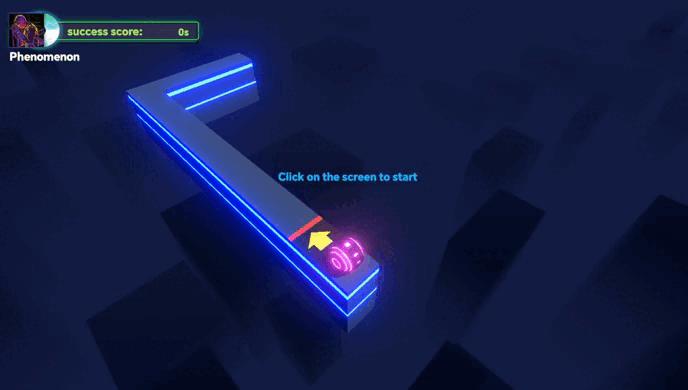

# Music Carnival

Ark of Panda World offers four mini-games for players to enjoy. Participating in these games requires spending PT. Completing score challenges within the games earns players pet hatching materials.

Each mini-game offers three difficulty levels for players to choose from. Higher difficulties yield higher score multipliers, resulting in more generous rewards for successful challenges. However, higher difficulties also require spending more PT to participate.

## Match Blocks

<figure><figcaption></figcaption></figure>

Players hold down a square and drag it in a direction to swap positions with an adjacent square in that direction.

If three or more squares of the same color are adjacent (either vertically or horizontally), they disappear, and points are earned. Victory is achieved when the score meets the requirement by the end of the allotted time.

## Music Road

<figure><figcaption></figcaption></figure>

Players start the game by left-clicking the screen, causing the metal ball to automatically move forward.

To make turns, players need to click the left mouse button to help the metal ball change direction.

There is no endpoint on the track, and the longer players persist, the higher their score.

## Disc Jockey

<figure><figcaption></figcaption></figure>

Once the game starts, rhythm blocks will move to the right.Once the game starts, rhythm blocks will move to the right.

Players must move the mouse up and down to keep the pointer within the dark blue rhythm blocks to score.

Achieving the required score before time runs out leads to victory.

## Rhythm Master

<figure><figcaption></figcaption></figure>

As the music begins, beats will appear on different tracks.

When a beat approaches the bottom button area, players must press the corresponding key (D/F/J/K) to score.

Achieving the required score before time runs out leads to victory.

The Music Carnival features a separate leaderboard for each game. The higher a player's score during gameplay, the higher their ranking.The PT spent by players participating in the game will enter the corresponding game's prize pool.

The top 10 players on the daily leaderboard can share the PT from the corresponding game's prize pool.Leaderboards refresh daily at 8:00 (UTC+8).

## Hoodle Game

We also provide a game for players who own a certain amount of VST to earn more VST - Hoodle Game.

<figure><figcaption></figcaption></figure>

In the Hoodle Game, players need to spend 10 VST for each ball they shoot. As the ball drops and rebounds off obstacles, it lands in the multiplier area below, where they earn 10 times the multiplier in VST.

During the ball's descent, there's a chance it may encounter seven special obstacles colored red, orange, yellow, green, cyan, blue, and purple. When the ball hits one of these obstacles, it lights up the corresponding color on the Bonus Energy Bar. If the bonus is activated and no more balls are shot, the Bonus Energy Bar will return to its original state after a period of time.

Once all seven colors of the balls are lit up, the Bonus Energy Bar is fully activated, and the game enters Bonus Time. During Bonus Time, the multiplier for the prize pool increases by 10 times until the energy bar is depleted. Players can then receive incredibly generous VST rewards.

Players can click "Auto" and then "Start" to automatically launch the balls.
