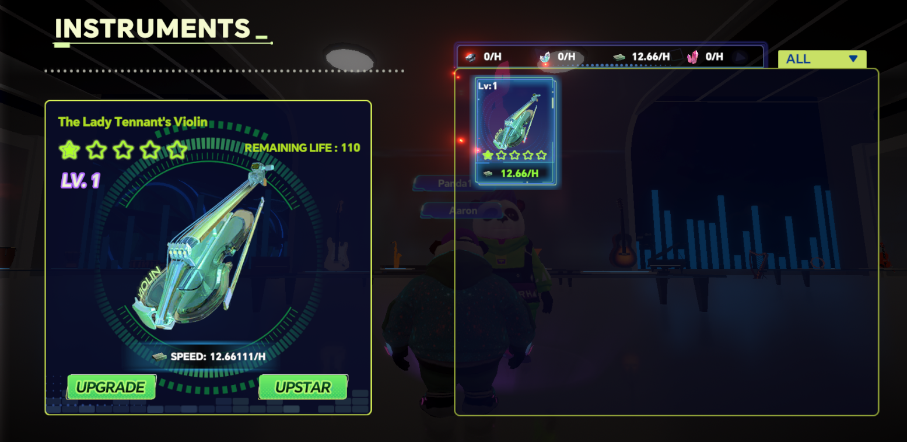
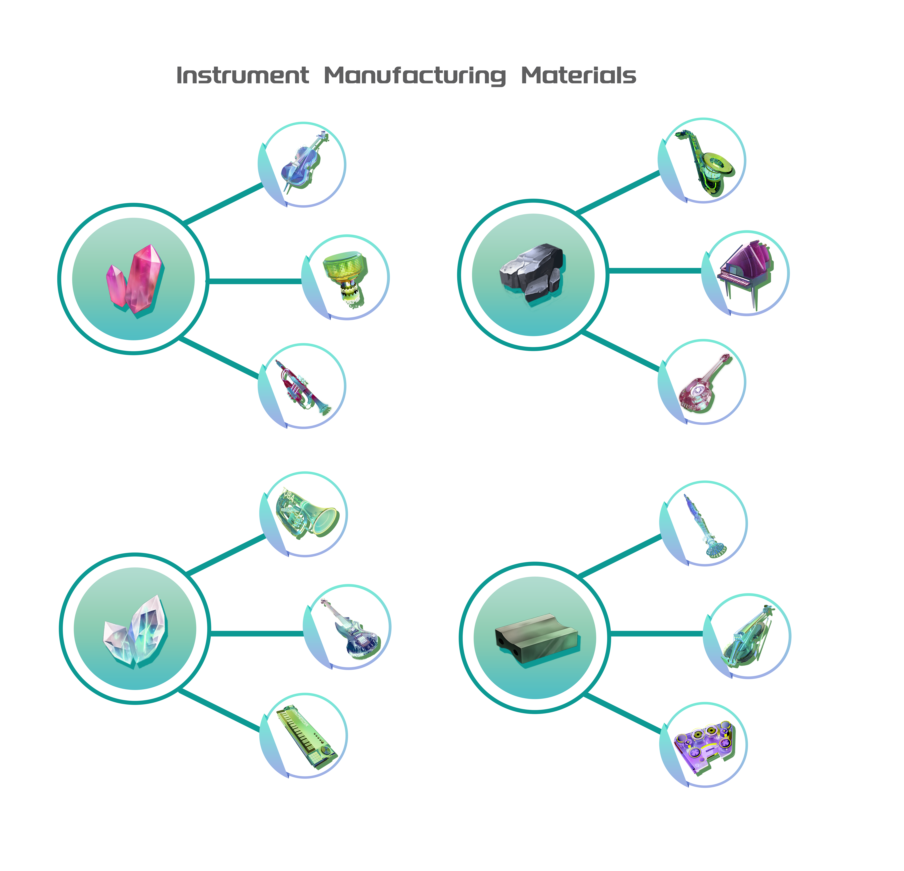
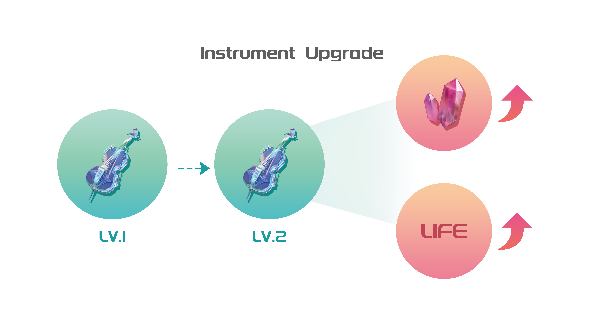
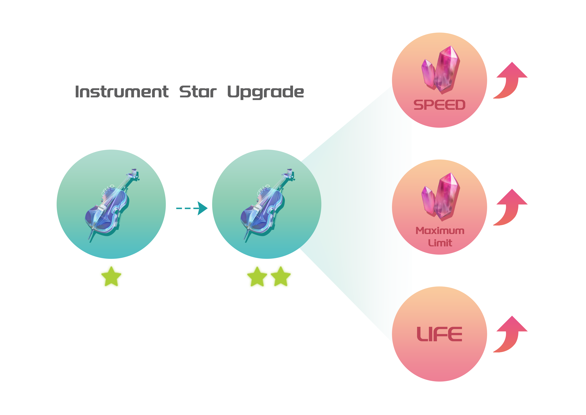

# Omix Instruments

<figure><figcaption>
Instrument inventory
</figcaption></figure>

Musical instruments are the only items used by Daffy Panda to produce materials on the Utopian planet.

The instruments can produce common materials used for crafting equipment. Different instruments yield different materials.

<figure><figcaption></figcaption></figure>

The musical instruments have two growth lines: level and star rating. Increasing both the level and star rating can enhance the efficiency of the instrument in producing materials.

* To upgrade the level of musical instruments, players only need to consume PT. The maximum level is 20, and there is a chance of failure when upgrading. The higher the level, the higher the probability of upgrade failure.

<figure><figcaption></figcaption></figure>

|     Level     | Probability |     Level     | Probability |
| :-----------: | :---------: | :-----------: | :---------: |
|  Lv.1 → Lv.2  |     100%    | Lv.11 → Lv.12 |     82%     |
|  Lv.2 → Lv.3  |     100%    | Lv.12 → Lv.13 |     80%     |
|  Lv.3 → Lv.4  |     98%     | Lv.13 → Lv.14 |     78%     |
|  Lv.4 → Lv.5  |     96%     | Lv.14 → Lv.15 |     76%     |
|  Lv.5 → Lv.6  |     94%     | Lv.15 → Lv.16 |     74%     |
|  Lv.6 → Lv.7  |     92%     | Lv.16 → Lv.17 |     72%     |
|  Lv.7 → Lv.8  |     90%     | Lv.17 → Lv.18 |     70%     |
|  Lv.8 → Lv.9  |     88%     | Lv.18 → Lv.19 |     68%     |
|  Lv.9 → Lv.10 |     86%     | Lv.19 → Lv.20 |     66%     |
| Lv.10 → Lv.11 |     84%     |               |             |

* To upgrade the star level of musical instruments, players need to consume PT along with another Identical instrument of the same star level.There is a chance of failure when upgrading the star level.

<figure><figcaption></figcaption></figure>

<table data-full-width="false"><thead><tr><th align="center">Instrument Star</th><th align="center">Probability</th><th align="center">Instrument Star</th><th align="center">Probability</th></tr></thead><tbody><tr><td align="center">1 star → 2 star</td><td align="center">96%</td><td align="center">6 star → 7 star</td><td align="center">78%</td></tr><tr><td align="center">2 star → 3 star</td><td align="center">92%</td><td align="center">7 star → 8 star</td><td align="center">75%</td></tr><tr><td align="center">3 star → 4 star</td><td align="center">88%</td><td align="center">8 star → 9 star</td><td align="center">72%</td></tr><tr><td align="center">4 star → 5 star</td><td align="center">84%</td><td align="center">9 star → 10 star</td><td align="center">69%</td></tr><tr><td align="center">5 star → 6 star</td><td align="center">81%</td><td align="center"></td><td align="center"></td></tr></tbody></table>

Musical instruments have a lifespan that decreases every day, with the reduction rate depending on the level. Increasing the instrument to a specific level will increase the number of lifespan points reduced per day. When the lifespan reaches zero, the instrument stops producing materials.

* The output efficiency of instruments is related to their lifespan. If the lifespan is greater than 100, the output efficiency will increase; if it's less than 100, the output efficiency will decrease.

Upgrading can increase the lifespan of the musical instrument. The number of lifespan points increased upon upgrading depends on the instrument's level. Reaching a certain level will increase the lifespan points gained from upgrading.

## How to acquire instruments?

* Obtain instruments by purchasing instrument blind boxes at Nosie Land, the instrument store, using VST.
* Acquire from other secondary markets.
