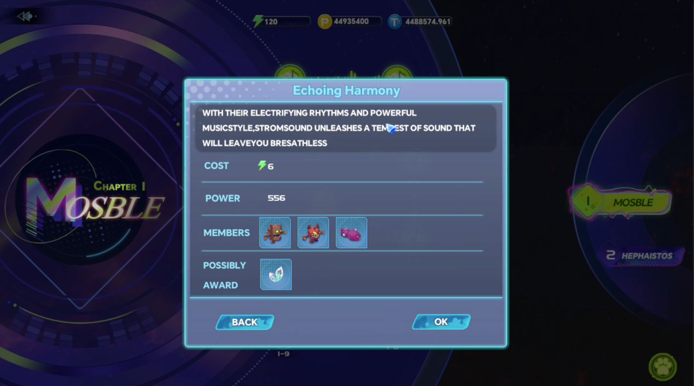
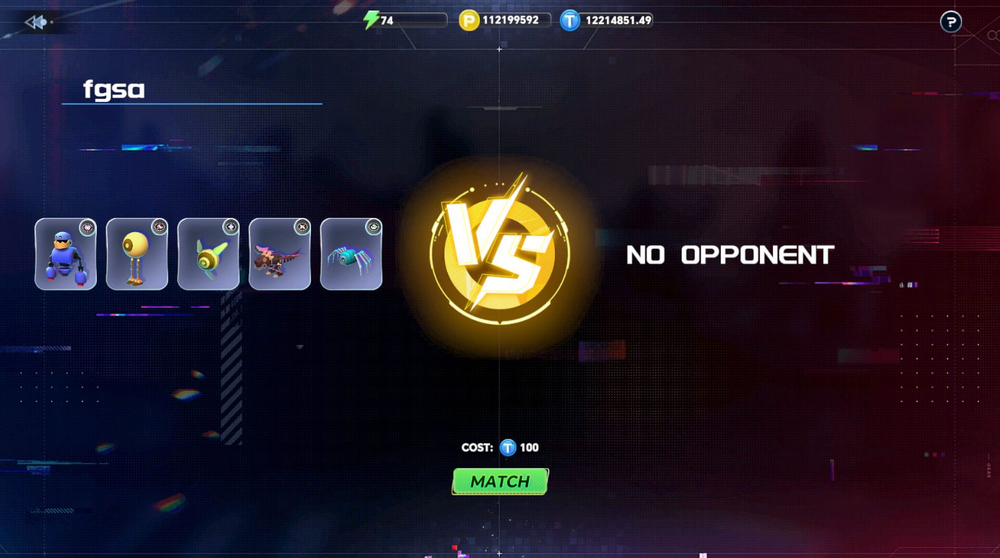

# Orpheus Challenge

## ORPHEUS TRIAL

<figure><figcaption></figcaption></figure>

Players can participate in the ORPHEUS TRIAL gameplay (PVE) by owning Orpheus.

Players can deploy up to 5 Orpheus at a time.

ORPHEUS TRIAL has multiple chapters, and players start by challenging the first chapter. They must complete all normal stages in the current chapter to unlock the next one.

After winning normal stages, players can obtain materials. Every 3 normal stages passed unlock an elite stage, which requires spending PT to participate. Winning can earn equipment blueprints, used to unlock higher-level equipment

Participating in battles requires spending 6 stamina points, which recovers over time. Stamina recovers 1 point every 6 minutes, with a maximum limit of 120 points.

## Omix Contest

<figure><figcaption></figcaption></figure>

The ORPHEUS CONTEST gameplay is more suitable for ambitious Orpheus trainers and allows players to win VST from other players.

Players can deploy up to 5 Orpheus at a time.

Players participating in ORPHEUS CONTEST must first pay 100 VST as a bet. The game will deduct 5% of the total bet amount from both sides as a handling fee, and the remaining VST will enter the prize pool. The winner receives all VST in the prize pool.

The ORPHEUS CONTEST is open from 10:00 (UTC+8) to 16:00 (UTC+8), and from 20:00 (UTC+8) to 2:00 (UTC+8).
