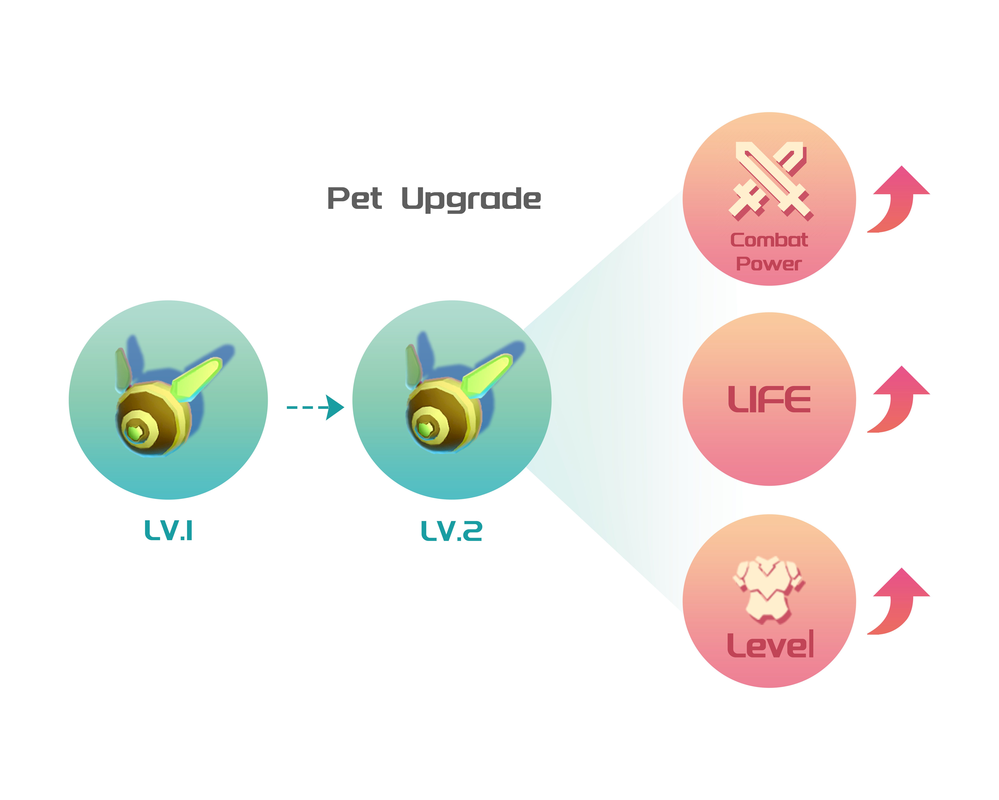
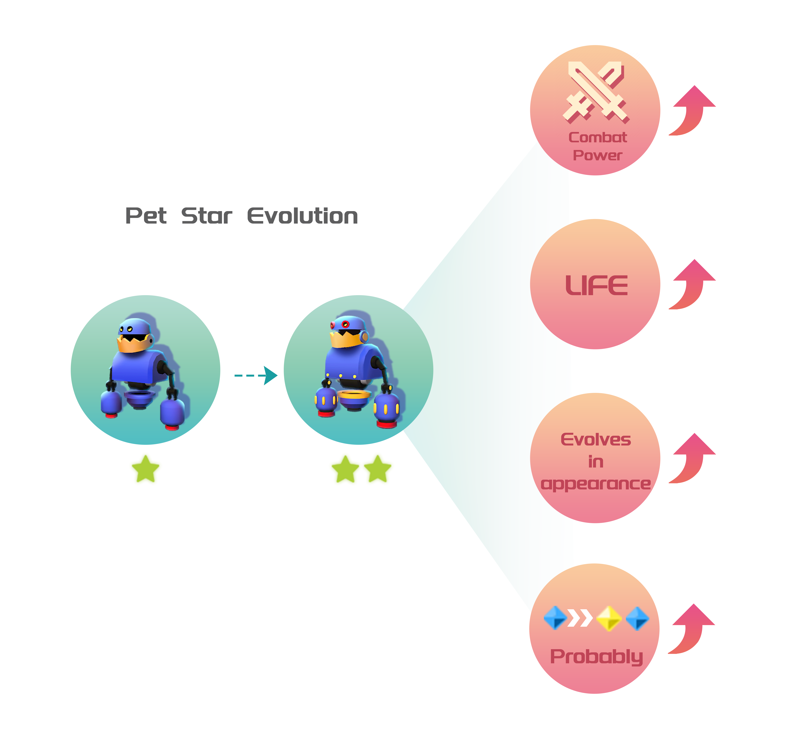

# Orpheus

## What can Orpheus do?

* Orpheus Trail（PVE）：Train your own Orpheus Band, adjust your lineup, challenge different levels, and acquire rare materials for crafting special equipment.
* Orpheus Contest (PVP): Choose your strongest lineup and compete against other players to win VST.

## Orpheus attributes

* **Popularity:** Life value;
* **Charm:** Defence;
* **Basic Skill:** Physical ttack;
* **Skill:** Magic Attack;
* **Proficiency:** Hit Rate;
* **Focus:** Evasion Rate;
* **Speed:** ttack Speed;
* **Perfect Perform:** Critical Hit Rate;
* **Perfect Effect:** Critical Hit Damage.

## Orpheus Careers

*  Tank;
*  Warrior;
*  Mage;
*  Archer;
*  Support;

<figure><figcaption></figcaption></figure>

## Level

Orpheus can be upgraded by consuming PT, with a maximum level of 60. There is a chance of failure when upgrading, and the higher Orpheus's level, the higher the chance of failure when upgrading.

Each time Orpheus is upgraded, there will be an increase in attribute values, thereby increasing their combat power.

Each time Orpheus is upgraded, there will be an increase in attribute values, thereby increasing their combat power.

The higher Orpheus's level, the higher level of equipment they can wear.

Pets have a lifespan, which decreases by 1 point every day. Increasing the level of the pet can increase its lifespan by 1 point.

<figure><figcaption></figcaption></figure>

## Star-level

Orpheus has 10 star levels, and each star-level upgrade greatly enhances its attributes, thereby increasing Orpheus's combat power.

As Orpheus's star level increases, the probability of successfully upgrading will decrease.

Each star level of Orpheus has a different form, and unlocking the final form requires reaching 10 stars!

Upgrading Orpheus's star level requires consuming another Orpheus of the same type. The star levels can be different, but the greater the difference between the star levels of the two Orpheus, the lower the probability of a successful upgrade.

When upgrading Orpheus's star level, there is a chance to acquire a new waveform, making your Orpheus even rarer! However, the more waveforms you have, the lower the probability of acquiring a new waveform when continuing to upgrade.

<figure><figcaption></figcaption></figure>

<table data-full-width="true"><thead><tr><th></th><th align="center">1-star</th><th align="center">2-star</th><th align="center">3-star</th><th align="center">4-star</th><th align="center">5-star</th><th align="center">6-star</th><th align="center">7-star</th><th align="center">8-star</th><th align="center">9-star</th></tr></thead><tbody><tr><td>1-star</td><td align="center">95%</td><td align="center"></td><td align="center"></td><td align="center"></td><td align="center"></td><td align="center"></td><td align="center"></td><td align="center"></td><td align="center"></td></tr><tr><td>2-star</td><td align="center">65%</td><td align="center">90%</td><td align="center"></td><td align="center"></td><td align="center"></td><td align="center"></td><td align="center"></td><td align="center"></td><td align="center"></td></tr><tr><td>3-star</td><td align="center">35%</td><td align="center">60%</td><td align="center">85%</td><td align="center"></td><td align="center"></td><td align="center"></td><td align="center"></td><td align="center"></td><td align="center"></td></tr><tr><td>4-star</td><td align="center">5.0%</td><td align="center">30%</td><td align="center">55%</td><td align="center">80%</td><td align="center"></td><td align="center"></td><td align="center"></td><td align="center"></td><td align="center"></td></tr><tr><td>5-star</td><td align="center">4.3%</td><td align="center">8.7%</td><td align="center">20%</td><td align="center">45%</td><td align="center">70%</td><td align="center"></td><td align="center"></td><td align="center"></td><td align="center"></td></tr><tr><td>6-star</td><td align="center">1.8%</td><td align="center">3.7%</td><td align="center">7.5%</td><td align="center">10%</td><td align="center">35%</td><td align="center">60%</td><td align="center"></td><td align="center"></td><td align="center"></td></tr><tr><td>7-star</td><td align="center">0.7%</td><td align="center">1.5%</td><td align="center">3.1%</td><td align="center">6.2%</td><td align="center">12.5%</td><td align="center">25%</td><td align="center">50%</td><td align="center"></td><td align="center"></td></tr><tr><td>8-star</td><td align="center">0.3%</td><td align="center">0.6%</td><td align="center">1.2%</td><td align="center">2.5%</td><td align="center">5%</td><td align="center">10%</td><td align="center">15%</td><td align="center">40%</td><td align="center"></td></tr><tr><td>9-star</td><td align="center">0.1%</td><td align="center">0.2%</td><td align="center">0.4%</td><td align="center">0.9%</td><td align="center">1.8%</td><td align="center">3.7%</td><td align="center">5.0%</td><td align="center">7.5%</td><td align="center">30%</td></tr></tbody></table>

## Equipment

Each Orpheus can wear 6 different pieces of equipment on different parts.

Wearing equipment can also increase the corresponding attribute values of Orpheus, thereby increasing their combat power.

## Omix Waveforms

There are a total of 5 waveforms, namely α, β, γ, δ, λ, each of which has a restraining relationship with the others.

Orpheus can have up to 5 different waveforms, and having each additional waveform can increase Orpheus's damage. Waveforms can be obtained through Orpheus's star-level upgrade probability.

<figure><figcaption></figcaption></figure>

## Companion Orpheus

A harmless Orpheus that always follows Daffy Panda and lacks combat capabilities, each one of them is extremely rare and valuable digital assets.

In the future, companion Orpheus will be able to automatically pathfind and lead players to instantly teleport to their destination, but this ability can only be used once in a while.

Companion Orpheus is currently only distributed through exclusive airdrops for DPGU holders.
